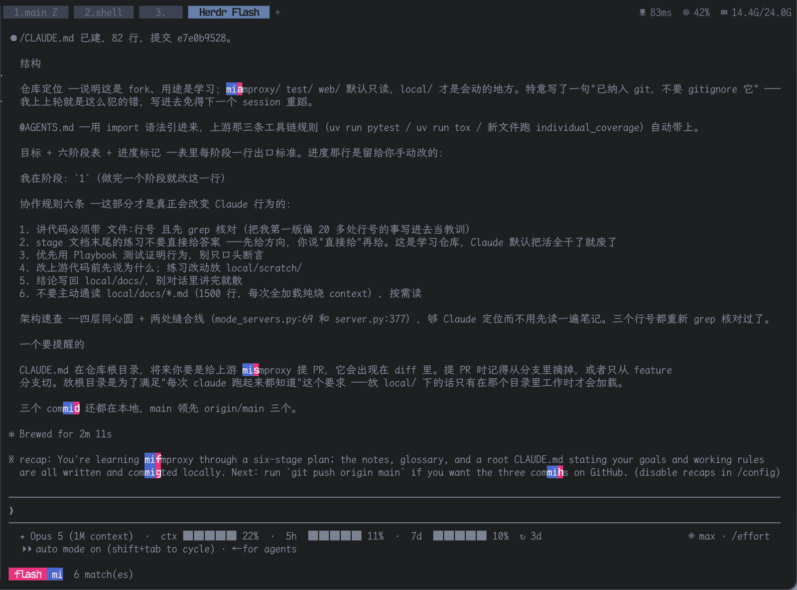
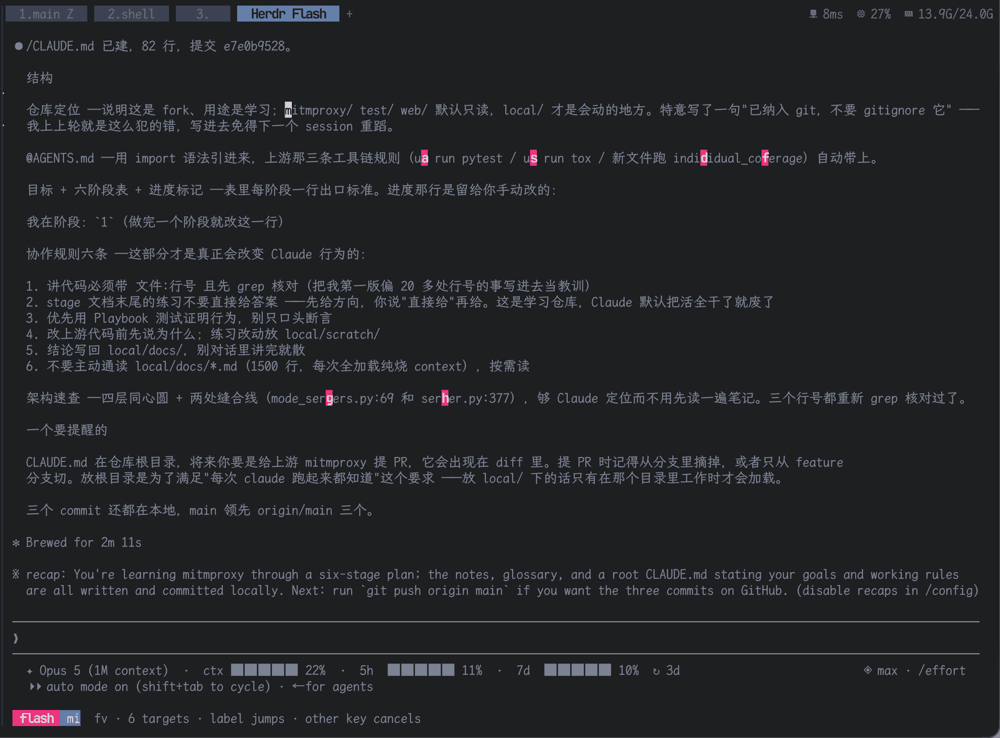
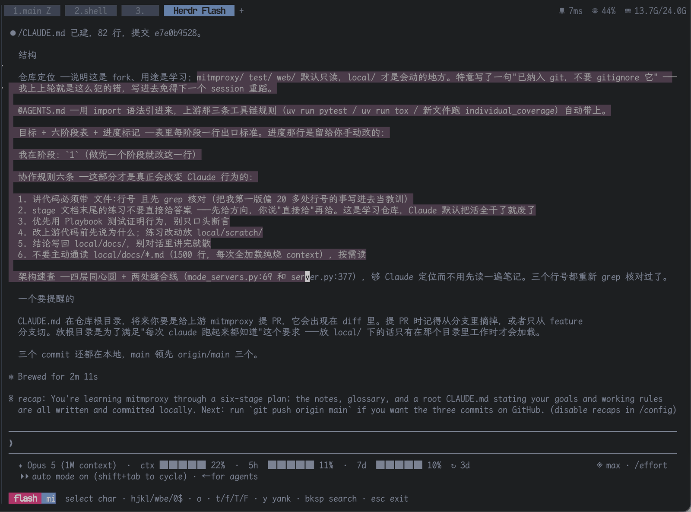

# Herdr Flash

[English](README.md) · **简体中文** · [日本語](README.ja.md)

Herdr Flash 是一个 [Herdr](https://herdr.dev) 插件，把 [flash.nvim](https://github.com/folke/flash.nvim) 的复制流程带到终端 pane 里：搜索可见文本，按标签跳到某个匹配，用 vim 动作选中，然后 yank 到系统剪贴板。

hint 类的选择器会**替你**决定什么算一个 token；Flash 把这件事拆成两个问题：搜索回答**看哪里**，动作回答**取什么**。敲几个字符，把光标落到目标上，再精确地拉出你要的那段文本——一个词、半个 URL、三行。

<table>
<tr>
<td width="33%" align="center" valign="top">
<a href="docs/images/01-search.png"></a>
<br><sub><b>1 · 搜索</b><br>输入 <code>mi</code>，pane 里每个命中都会点亮，紧跟着落下一个单键标签；状态行实时给出匹配数。</sub>
</td>
<td width="33%" align="center" valign="top">
<a href="docs/images/02-char-jump.png"></a>
<br><sub><b>2 · 按字符跳转</b><br>光标就位后，<code>f v</code> 把它之后的每个 <code>v</code> 变成带标签的目标——按标签即落点，按其他键取消。</sub>
</td>
<td width="33%" align="center" valign="top">
<a href="docs/images/03-select-yank.png"></a>
<br><sub><b>3 · 选中并 yank</b><br><code>v</code> 开一个字符选区，用 vim 动作跨行扩展；<code>y</code> 把它复制到系统剪贴板。</sub>
</td>
</tr>
</table>

## 流程

1. **搜索** —— 在聚焦的 pane 上触发这个 action，然后直接输入。每个匹配都会高亮，命中后面出现一个单字母标签。Backspace 放宽搜索；Enter 跳到第一个匹配。
2. **光标** —— 按下某个匹配的标签（或 Enter），光标会落在那个命中的第一个字符上。此时还没有选中任何东西。
3. **选中并 yank** —— `v` 开始字符选区，`V` 开始行选区。用 vim 动作扩展，然后 `y`（或 Enter）把选区复制到系统剪贴板。

任何阶段按 Escape 或 Ctrl-C 都会退出。

### 按键

| 阶段 | 按键 | 作用 |
|------|------|------|
| 搜索 | 任意字符 | 扩展查询（标签会被当作跳转吃掉，永远不会进入查询文本） |
| 搜索 | Backspace | 缩短查询 |
| 搜索 | Enter | 跳到第一个匹配 |
| 光标 / 选择 | `h j k l` | 按格移动 |
| 光标 / 选择 | `w b e` | 词首前进 / 后退 / 词尾 |
| 光标 / 选择 | `0 $` | 行首 / 行尾 |
| 光标 / 选择 | `t{char}` `f{char}` | till / find 某个字符，向前查找并跨行 |
| 光标 / 选择 | `T{char}` `F{char}` | 同上，但从光标向后查找 |
| 光标 / 选择 | `v` / `V` | 开始（或取消）字符 / 行选区 |
| 选择 | `o` | 交换光标端和锚点端 |
| 选择 | `y` 或 Enter | yank 选区（没有活动选区时无效） |
| 光标 / 选择 | Backspace | 回到搜索，查询保留 |
| 任何位置 | Esc / Ctrl-C | 不复制直接退出 |

`t`/`f`/`T`/`F` 只命中一个时直接跳过去。命中多个时每个会拿到一个单键标签——按标签选中其一，按其他键取消；命中数超过标签字母表时，`Space` 会把标签翻页到还没覆盖到的命中上，循环往复。

某个按键恰好是当前存在的标签时，它会执行跳转而不是扩展查询；按一次 Backspace 回到搜索，查询原样保留。

## 配置

默认情况下 yank 之后选择器会关闭。如果想连续抓好几段（用 Escape 离开）：

```bash
CONFIG_DIR="$(herdr plugin config-dir youguanxinqing.herdr-flash)"
$EDITOR "$CONFIG_DIR/config.toml"
```

```toml
[flash]
exit_on_yank = false
```

每次复制都会在状态行给出确认，搜索随即重置，等待下一次抓取。

### 颜色

默认调色板就是 flash.nvim 的那套观感。选择器画出来的一切由五个样式覆盖：

| 样式 | 画的是什么 | 默认值 |
|------|-----------|--------|
| `unmatched` | 匹配周围的 pane 文本，调暗以突出命中 | 灰 `#7a8294` |
| `match` | 当前查询的每个命中，以及状态行上的查询本身 | 蓝底白字 `#3e68d7` |
| `label` | 画在每个命中之后的跳转键，以及 `flash` 标记块 | 品红底白字 `#ff007c`，加粗 |
| `selection` | 活动中的 `v`/`V` 选区主体 | 暮色背景 `#4d3a4a` |
| `cursor` | 光标 / 选区可移动的那一端 | 白底黑字 |

在同一个配置文件的 `[colors]` 下可以覆盖其中任意一个。每个样式接受 `fg` 和 `bg`，取 `"#rrggbb"` 十六进制值，或者 `"none"` 把该通道清回终端默认色，另外还有一个 `bold` 布尔值：

```toml
[colors]
unmatched = { fg = "#6f7788" }               # 把背景文本压得更暗
label = { bg = "#e91e63" }                   # 柔一点的粉；fg 和 bold 保持默认
match = { bg = "none", fg = "#e5c07b" }      # 不填底色 —— 改成纯黄色文字
```

没写的样式和没写的键都保留默认值；非法值会被忽略，并在 stderr 上给出警告，而不是把选择器搞坏。颜色是 24 位真彩，Herdr 和所有现代终端都支持。

## 依赖

- Herdr 0.7.4 或更新版本
- Rust/Cargo（目前安装时从源码构建，还没有预编译的 release 产物）
- 一个系统剪贴板命令：
    - macOS：`pbcopy`
    - Linux Wayland：`wl-copy`
    - Linux X11：`xclip` 或 `xsel`

## 安装

```bash
herdr plugin install youguanxinqing/herdr-flash
```

要安装某个特定分支、tag 或 commit，加 `--ref`。从本地 checkout 安装：

```bash
herdr plugin link .
```

确认 Herdr 能看到这个 action：

```bash
herdr plugin action list --plugin youguanxinqing.herdr-flash
```

想移除：`herdr plugin uninstall youguanxinqing.herdr-flash`（本地 link 的话用 `herdr plugin unlink youguanxinqing.herdr-flash`）。

## 快捷键绑定

在 Herdr 配置里加一条 `plugin_action` 绑定，然后 `herdr server reload-config`：

```toml
[[keys.command]]
key = "prefix+s"
type = "plugin_action"
command = "youguanxinqing.herdr-flash.flash"
description = "flash: search visible text, then select and yank"
```

## 工程笔记

复杂的回归问题、以及防止它们再次发生的不变量，都记录在
[`docs/bugs/`](docs/bugs/README.md) 里。其中
[Flash picker entry blink](docs/bugs/flash-picker-entry-blink.md) 记录了隐藏 tab 的绘制握手，
以及源 pane 与选择器之间的几何拆分。

## 致谢

- [flash.nvim](https://github.com/folke/flash.nvim)，作者 folke —— 本插件致敬的交互模型：搜索驱动的导航配上带标签的跳转，把「落下光标」和「选定文本」当成两件独立的事。
- [herdr-pluck](https://github.com/rmarganti/herdr-pluck)，作者 rmarganti —— Herdr Flash 最初是它的一个 fork，pane 快照、选择器管线和渲染器至今仍站在那份工作之上。如果你要的是一键抓取形状固定的 token（URL、SHA、路径），pluck 才是对的工具；Flash 适合你知道内容、但不知道形状的场合。

## 许可证

MIT —— 见 [LICENSE](LICENSE)。
